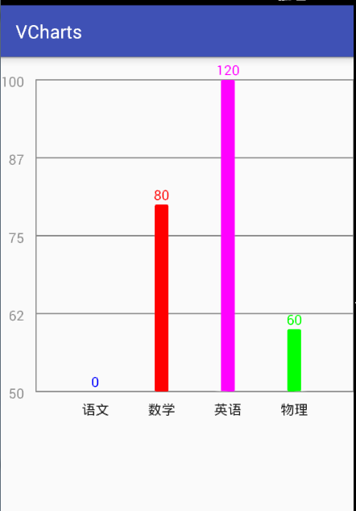
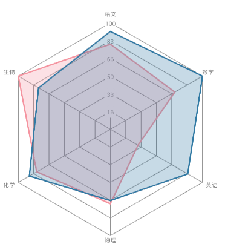
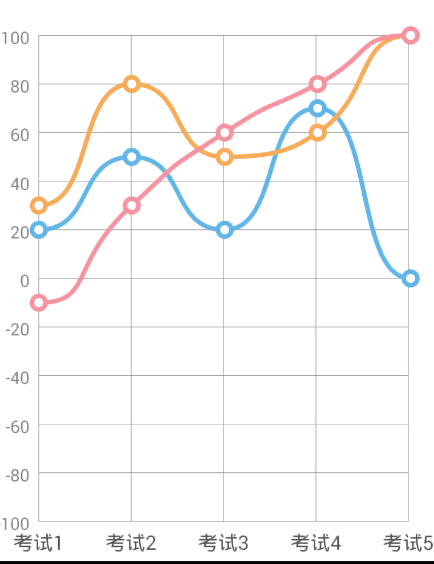

# VCharts

## Preview







## usage

>compile 'com.vinctor:vcharts:0.0.2'

### 雷达图

添加至```xml```中

     <com.vinctor.vchartviews.radar.RadarChart
            android:id="@+id/radarview"
            android:layout_width="match_parent"
            android:layout_height="match_parent" />
            
```java```代码中

           radarView.setCount(6)//多边形几条边
                .setDensity(6)//雷达图蜘蛛网密度
                .setMinAndMax(0, 100)//最小与最大值
                .setAlpha(150)//雷达图数据遮盖透明度
                .clearData()//清楚数据
                .setList(list)//设置数据
                .addData(data)//添加数据
                .setTitleTextSize(30)//雷达边角标题文字大小(px)默认30
                .setTagTextSize(30)//雷达刻度文字大小
                .setTitles(new String[]{"语文", "数学", "英语", "物理", "化学", "生物"})//边角文字
                .commit();//以上设置需要此方法才能生效

### 柱状图

添加至```xml```中

    <com.vinctor.vchartviews.bar.BarChart
        android:id="@+id/bar"
        android:layout_width="match_parent"
        android:layout_height="400dp" />
        
```java```代码中

      bar.setMinAndMax(50, 100)
                .setDensity(4)//数值方向的刻度密度
                .setBarWidth(30)//柱状图宽度.默认为宽度的1/10
                .setGraduationTextSize(30)//左侧刻度的文字大小
                .setTitleTextSize(30)//底部文字大小
                .setBarTextSize(30)//柱状图上方数字大小
                .setData(new BarData("语文", 0, Color.BLUE))
                .addData(new BarData("数学", 80, Color.RED))
                .addData(new BarData("英语", 120, Color.MAGENTA))
                .addData(new BarData("物理", 60, Color.GREEN))
                .commit();
                
### 折线图

添加至```xml```中

    <com.vinctor.vchartviews.line.LineChart
        android:id="@+id/line"
        android:layout_width="match_parent"
        android:layout_height="match_parent" />
        
```java```中

      line.setDensity(5)
                .setTitleTextSize(30)//底部标题大小
                .setLineSmoothness(0.3f)//折线平滑度
                .setCoordinateTextSize(30)//刻度文字大小
                .setCoorinateColor(0xff888888)//刻度文字颜色
                .setLineStrokeWidth(8)//网格线宽度
                .setTitles(new String[]{"语文", "数学", "英语", "物理", "化学"})//底部标题,需与折线数据长度一致
                .setTitleTextSize(30)//底部标题文字大小
                .setMinAndMax(-100, 100)
                .addData(new LineData(new int[]{20, 50, 20, 70, 0}, 0xff61B6E7))//需与title长度一致
                .addData(new LineData(new int[]{30, 80, 50, 60, 100}, 0xffF8AC58))
                .addData(new LineData(new int[]{-10, 30, 60, 80, 1500}, 0xffF593A0))
                .commit();
                
### 未完待续
